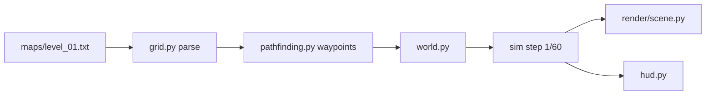

# Towers — Parameter Design

PySide6 tower defense for Windows. Infinitode-style: fixed road path, grid tower placement,
endless waves, in-run tower leveling.

**Decisions locked:** 6 towers / 7 enemies (incl. flyers) · endless only · sprite sheets · in-run progression only (no save-gated meta tree).

---

## 0. Architecture

Simulation is pure Python and Qt-free. Rendering is a thin Qt layer that reads sim state.

```
game/
  sim/        # deterministic, fixed dt, headless-runnable, unit-testable
    grid.py  pathfinding.py  enemy.py  tower.py  projectile.py
    wave_manager.py  economy.py  damage.py  world.py
  render/
    scene.py  loop.py  items/  atlas.py  sprite_cache.py
  ui/
    main_window.py  hud.py  shop_bar.py  inspector_panel.py  overlays.py
  data/
    towers.json  enemies.json  waves.json  damage_matrix.json  atlas.json
    maps/level_01.txt
  assets/
    enemies.png  towers.png  projectiles.png  fx.png  tiles.png  ui.png
tools/
  balance_sim.py   # headless wave-curve sweep, no Qt
```

**Why:** balance tuning via simulation instead of playtesting, and a renderer that can be replaced
(QGraphicsView → QOpenGLWidget) without touching game logic. Any Qt import inside `game/sim/` is a bug.

---

## 1. Board & coordinates

| Param | Value |
|---|---|
| `TILE_PX` (logical) | 32 |
| `ART_SCALE` | 2 (art authored at 64 px, downscaled at load) |
| Map grid | 40 × 24 tiles → 1280 × 768 logical scene |
| Camera | fixed in v1; zoom/pan interfaces reserved but not bound |
| Tile glyphs | `#` road · `.` buildable · `X` blocked · `S` spawner · `E` base · `*` bonus coin |
| Path | waypoints derived from road graph at load (Dijkstra); enemies lerp between waypoints |
| Flyers | straight line `spawner → base`, ignore road |
| Coordinates | all sim math in **tile units** (floats), converted to px only in `render/` |

Keeping sim in tile units means changing `TILE_PX` never touches gameplay numbers.



---

## 2. Timing

| Param | Value |
|---|---|
| `FIXED_DT` | 1/60 s |
| Loop | accumulator, max 5 catch-up steps per frame |
| Time scale | 1× / 2× / 3×, applied as multiplier on dt (never on timer interval) |
| Pause | `paused` flag + `time_scale` preserved |
| Prep phase | 8 s auto-start |
| Early call bonus | `round(prep_remaining * 2)` coins |
| Frame budget | 16.6 ms; sim ≤ 6 ms, render ≤ 8 ms |

---

## 3. Enemy parameters

| Type | HP | Speed (t/s) | Armor | Bounty | Leak | Trait |
|---|---|---|---|---|---|---|
| `basic` | 100 | 1.5 | 0 | 8 | 1 | — |
| `fast` | 60 | 3.2 | 0 | 10 | 1 | — |
| `heavy` | 420 | 0.9 | 4 | 25 | 3 | — |
| `armored` | 220 | 1.2 | 14 | 20 | 2 | energy pierces 50% armor |
| `flyer` | 150 | 2.0 | 0 | 18 | 1 | ignores road |
| `healer` | 180 | 1.3 | 2 | 22 | 2 | +15 hp/s to allies within 2 t |
| `boss` | 5000 | 0.8 | 10 | 400 | 20 | slow/CC duration ×0.5 |

Reserved-but-unused fields: `shield`, `regen`, `resist{}`, `size`, `death_spawn`.

---

## 4. Endless wave scaling

$$hp_{mult}(w) = \bigl(1 + 0.098(w-1)\bigr) \cdot 1.058^{\,w-1}$$

$$count_{mult}(w) = 1 + 0.155(w-1), \qquad
speed_{mult}(w) = \min\bigl(1.8,\ 1 + 0.008(w-1)\bigr)$$

$$bounty_{mult}(w) = \bigl(1 + 0.03(w-1)\bigr) \cdot 1.045^{\,w-1}$$

| Wave | HP × | Bounty × | Ratio |
|---|---|---|---|
| 10 | 3 | 2 | 1.7 |
| 25 | 13 | 5 | 2.6 |
| 50 | 92 | 21 | 4.3 |
| 100 | 2 841 | 310 | 9.2 |
| 200 | 1 529 129 | 44 399 | 34.4 |

The HP/bounty ratio widening is the intended difficulty pressure — it's why upgrades are mandatory,
not optional. Curve is deliberately slower than pure `1.11^w` so a competent run reaches ~wave 60-80
rather than ~wave 35.

The curve has been moved twice. It was eased (`hp_lin` 0.09 → 0.075, `hp_exp` 1.058 → 1.052) after a
headless probe showed why base health alone does not make the game easier: a build with too few
towers dies on the same wave whatever its base HP, it just leaks more times on the way. When the
failure is a DPS shortfall, the only lever that moves the wall is enemy health. That probe put a
6-tower build at wave 16 before and wave 17 after, while a 10-tower build went from 12 leaks to 4.

It was then tightened back up (`hp_lin` 0.075 → 0.087, `hp_exp` 1.052 → 1.056, `count_lin`
0.135 → 0.145) because the eased version was too soft, alongside three changes that all push the
other way: flyers now walk the road instead of flying a straight line, three of the ten towers are
ground-only so they cannot answer those flyers at all, and banked coins earn interest.

A matched comparison — same builder, same seed, same map, only the scaling changed — put the three
versions close together, because the late-game wall is structural rather than curve-driven:

| Towers | original (0.09 / 1.058 / 0.15) | previous (0.075 / 1.052 / 0.135) | current (0.087 / 1.056 / 0.145) |
|---|---|---|---|
| 7 | died w9 | died w10 | died w9 |
| 12 | died w50 | died w61 | died w58 |
| 16 | died w59 | died w64 | died w61 |
| 22 | died w55 | died w61 | died w58 |

### Difficulty is selected, not baked in

The curves above are the **Normal** setting. Every number in them is scaled by
three multipliers chosen in-game (`data/waves.json` → `difficulty`): `size` on the
wave count, `power` on enemy health, and `growth` on how far the curves have
travelled from their wave-1 baseline. `growth` scales the *distance from 1.0*
rather than the multiplier itself, so `growth: 0` would hold every wave at the
baseline instead of meaning "zero health".

Enemy HP at wave 20 across the six settings: ×1.0 (the old Normal), ×1.3, ×2.0,
×3.4, ×5.9, ×10.3. Normal is **×2.0 enemy health**, and Relaxed is pinned at ×1.0
so a preset always exists that plays the way the game did before the doubling.
Each rung is about 1.4× the last. Bounty is deliberately unscaled — compensating
the economy would make the higher settings not actually harder, just longer.

### The power multiplier has to ramp in

The flat multiplier is **not** applied from wave 1. It ramps linearly to full
strength over `power_ramp_waves` (25):

```
effective power = 1 + (power - 1) * min(1, (wave - 1) / (power_ramp_waves - 1))
```

| Wave | 1 | 5 | 10 | 15 | 25+ |
|---|---|---|---|---|---|
| Effective power at Normal | ×1.00 | ×1.17 | ×1.38 | ×1.58 | ×2.00 |

This is not a softening for its own sake. A flat multiplier turned out to be a
different game rather than a harder one: measured with the probe, **every build
died at wave 6** with ×2 applied from wave 1 — including the 22-tower budget that
previously reached wave 66.

The cause is that the opening has almost no slack. The starting economy buys about
seven Basic towers and wave 1 is only just winnable with them, so doubling enemy
health there is not a scaling challenge, it is an unwinnable one. Difficulty that
does not scale with the player's growth lands entirely on the phase where the
player has the least room.

The ramp fixes it properly: the opening is untouched, and the multiplier reaches
full strength exactly when the player has an economy to answer it. Measured, the
wall sits at **wave 57** at Normal (from 66), and the small-build failure point is
unchanged at wave 10.

Worth internalising: doubling enemy health does **not** halve the wave you reach.
66 → 57, because the run ends at a cliff rather than at a fraction. Once damage
stops keeping up the run is over, and how far the cliff moves depends only on how
many waves it takes the curve to add another 2×.

### The power ceiling, and what fixed it

Measured with `tools/balance_probe.js` on level_01, seed 12345, **before** the later
specialisation tiers existed:

| Towers | Final DPS | DPS/tower | Growth stops at | Died wave | Coins left |
|---|---|---|---|---|---|
| 9 | 8 008 | 890 | wave 42 | 50 | 218 289 |
| 16 | 15 073 | 942 | wave 55 | 61 | 360 956 |
| 30 | 21 102 | 703 | never | 58 | 32 986 |

DPS per fully upgraded tower was a **constant (~900)** regardless of build size.
Level 20 multiplies damage by `1.12^19 ≈ 8.6×` and rate by `1.06^19 ≈ 3.0×`, and
specialisations contributed a single tier, so a tower's output saturated at level
20 and then never changed again. Enemy health does not saturate: `hp_mult` grew
108× → 164× between wave 55 and wave 61. Every budget from 9 to 30 towers died
between wave 50 and 64, and 200 000–360 000 coins sat unspent because the upgrade
path they existed to feed had run out.

Three symptoms confirmed it: every budget died in the same narrow band; budget 30
reached *higher* total DPS than budget 16 and still died at the same wave (it
simply spread the same coins over more towers, 703 vs 942 DPS each); and the dead
coin pile.

**The fix was four specialisation tiers instead of one.** A tier *multiplies* a
tower rather than incrementing it, so it compounds with the level scaling already
in place. Measured across all 160 possible paths (16 per tower), the median path
multiplies a maxed tower by ×3.7–5.3 depending on the tower, and no path is worse
than unspecialised. Re-running the same probe:

| Towers | Before | After |
|---|---|---|
| 7 | died wave 10 | died wave 10 |
| 12 | died wave 50 | died wave 59 |
| 16 | died wave 60 | died wave 66 |
| 22 | died wave 54 | died wave 66 |

The wall moved 6–12 waves and the probe now buys 48–85 specialisations instead of
~16. Small builds are unaffected, correctly: seven towers have not finished
levelling by wave 10, so later tiers cannot help them.

### Levers that do NOT work

`hp_lin` / `hp_exp` are a weak late-game lever. They change *when* the ceiling is
reached, not whether it can be escaped — which is why the three curve variants
earlier in this section sit within a few waves of each other. Curve tuning is the
right tool for the early and mid game and the wrong tool for the late game.

`max_level` and the specialisation tiers are the levers that move the wall.

### Remaining

The economy still has no sink that survives a *fully finished* run: once every tower
is maxed, every tier is taken and six barracks are standing, coins accumulate
unspent. The barracks mechanic is a partial answer worth noting — it is the first
purchase in the game whose cost escalates super-linearly (`1.45ⁿ`) and that has a
hard ceiling of six, so it absorbs roughly 2 700 coins over a run and then stops.
That is a bounded sink, not a solution. Savings interest, meanwhile, still compounds
the dead pile rather than rewarding a decision.

### Early game

Small builds used to die at **wave 9–10** on five of the six maps, with 9–10 leaks,
when `armored` unlocked (14 flat armour) and a build of Basics and Gatlings had no
answer to it. That was a legitimate "you needed an armour answer" signal rather than
a spike, and it is still the cheapest place in the game to teach it.

**This has partly changed with the barracks.** A build that can only afford 7 towers
used to be hard-capped at 4 and died at wave 10 regardless of skill; with one
barracks it now reaches wave 25. The armour lesson has not moved — wave 9 is still
where an unarmoured build stalls — but it is no longer also the tower limit biting.
When re-measuring the early game, separate the two: a build that dies around wave 9
with the limit already raised needs an armour answer, and one that dies there *at*
the limit needs a barracks.

### Design target for the tiers, and what actually happened

The probe pinned the wall at wave ~60, where enemy health is **153×** base and a maxed tower was
stuck at ~900 DPS. Holding that same line further out needs proportionally more damage, and the
three unauthored tiers were the only thing that could supply it:

| Reach wave | Enemy HP × | Tougher than wave 60 | Multiplier needed per new tier |
|---|---|---|---|
| 70 | 301 | 1.97× | 1.25× |
| **80** | **583** | **3.82×** | **1.56×** |
| 90 | 1 116 | 7.31× | 1.94× |
| 100 | 2 116 | 13.86× | 2.40× |

The brief taken from this was "each of tiers 10, 15 and 20 should multiply a tower by roughly
1.5–1.6×, so three tiers compound to ~4× and put the wall near wave 80."

**Outcome:** the measured median path multiplier is ×3.7–5.3 depending on the tower, which is on
target. The wall moved to **wave 66**, not 80. The gap is not the tiers under-delivering; it is that
the probe's builder takes the *first* option at every tier rather than the strongest, and it now
spends so much on specialisations that its upgrades arrive later. A player picking deliberately
should get further than the probe does.

Worth noting for anyone re-tuning: the tiers multiply rather than add, which is what let them
compound with the existing level scaling. An additive bonus on top of a ceiling just relocates the
ceiling.

### Caveat on cross-map numbers

At 16 towers the probe reaches wave 61 on Switchbacks but only 29 on The Z and 38 on Staircase. The
fixed placement heuristic is simply worse on those layouts, so map-to-map differences in probe output
partly measure the builder. Do not read them as a verdict on map difficulty.

**Checkpoints**
- every 10 waves: mini-boss pack (`hp ×4`, `bounty ×6`)
- every 25 waves: boss (`hp ×1`, boss template, `bounty ×1`)
- wave clear bonus: `17 + 3.4w`
- concurrency cap: **300 enemies**; packs queue when saturated (protects the frame budget)
- run continues until base HP ≤ 0; score = highest wave reached
- `best_wave` persisted to `%APPDATA%/Towers/highscore.json` (a record, not progression)

---

## 5. Tower parameters

| Tower | Cost | Dmg | Rate/s | Range (t) | Type | Special |
|---|---|---|---|---|---|---|
| `basic` | 50 | 12 | 2.0 | 3.0 | physical | — |
| `cannon` | 120 | 45 | 0.8 | 3.5 | physical | splash 1.0 t, ground only |
| `frost` | 90 | 7 | 1.2 | 2.8 | ice | slow 35% for 2 s |
| `tesla` | 150 | 20 | 1.5 | 2.5 | energy | chain 3, ×0.7 per hop |
| `venom` | 140 | 6 | 1.0 | 3.0 | poison | +18 dmg/s × 4 s, stacks ×3, ignores armor |
| `sniper` | 200 | 130 | 0.5 | 8.0 | physical | hitscan, ×1.5 vs armored |

**Damage formula**

$$raw = dmg \times type_{mult} \times level_{mult} \times crit_{mult}$$

$$final = \max(0.1 \cdot raw,\ raw - armor_{eff}) \times (1 - resist_{type})$$

Always a 10% damage floor, so no matchup is fully immune. Armor is flat subtraction, resist multiplicative.

**Damage-type matrix**

| Type | Armor handling | Multiplier notes |
|---|---|---|
| physical | full flat subtraction | ×1.0 |
| energy | `armor × 0.5` | ×1.0 |
| poison | `armor × 0` | ×0.6 vs shielded |
| ice | full flat subtraction | low base dmg; pays for CC |
| fire | full flat subtraction | ×1.5 unarmored, ×0.5 armored (reserved) |

**In-run leveling** — damage dealt feeds XP, level 1→10:

| Per level | Value |
|---|---|
| damage | +12% |
| range | +4% |
| rate | +6% |

Buy-upgrade cost: `0.6 × base_cost × 1.32^(level-1)`. Sell refund: 70% of total invested.
Specialisation cost: `1.2 × base_cost`, charged once per tier (section 6).

**Targeting modes:** `first` (max path progress, default) · `last` · `strongest` · `weakest` · `closest`

**Reserved fields:** `homing`, `debuff_apply_chance`. (`pierce` is live now -- see section 6.)

---

## 6. Specialisations

Every tower gets a **branching choice at level 5**, and picks exactly one of two
options. The system is tier-driven, so a second tier later is pure data.

Defined in `data/specialisations.json`, keyed by tower, each entry a list of tiers:

```json
"cannon": [
  { "tier": 5, "options": [
      { "key": "cluster", "name": "Cluster Shells", "blurb": "...",
        "mult": { "splash_radius": 1.6, "damage": 0.8 } },
      { "key": "heat", "name": "HEAT Shells", "blurb": "...",
        "mult": { "damage": 0.85 }, "flags": { "true_damage": 1 } }
  ] }
]
```

### Modifier kinds

| Key | Meaning | Merge across tiers |
|---|---|---|
| `mult` | Multiplies a stat | multiplied |
| `add` | Additive integer (`chain_count`, `poison_max_stacks`) | summed |
| `override` | Replaces a value outright (`slow_factor`, `ground_only`) | last wins |
| `flags` | Grants a named mechanic | summed, except booleans which take the max |

`override` exists because `slow_factor` is a *speed* multiplier: a stronger slow
is a smaller number, so expressing Deep Freeze as a `mult` would mean writing
`0.69` and expecting the reader to work out that it is a buff.

### The creative bonuses

| Flag | Effect |
|---|---|
| `crit_chance` / `crit_mult` | Chance a hit deals multiplied damage |
| `execute_below` | Instant kill under a fraction of max hp |
| `burn_dps` / `burn_duration` / `burn_stacks` | Fire damage-over-time |
| `armor_shred` / `armor_shred_duration` | Flat armour removal, for every tower's benefit |
| `bounty_mult` | Coin multiplier on a killing blow |
| `true_damage` | Hits ignore armour entirely |
| `pierce` | Projectile passes through extra enemies |
| `allow_air` | Lifts a `ground_only` restriction |

Several options exist to **cancel a tower's own weakness** rather than just add
numbers, which is what makes the choice interesting:

* **HEAT / Sabot / Railgun / Shaped Charge** give the armour-weak towers a way
  through flat armour.
* **Airburst Fuse** is the only thing that lets a mortar reach flyers.
* **Corrosive Venom** shreds armour for *every other tower*, turning a solo
  damage tower into a support pick.
* **Shatter** adds an execute to Frost, giving a low-damage control tower a
  finisher role.

### Where the effects live

`Tower._recalc` resolves base stats x level scaling x specialisations into plain
fields (`damage`, `splash`, `chainCount`, `burnDps`, ...). Nothing downstream
reads `d` for combat stats or knows that specialisations exist:

* `Projectile.launch` copies the *tower's* resolved values, not the definition's.
* `World.applyDamage` reads `enemy.effectiveArmor` and `owner.trueDamage`.
* `World._applyRiders` applies slow / poison / burn / corrosion from whatever
  carried the hit -- projectile or tower.

Damage-over-time stacks are tagged with their damage type, so an incendiary
gatling and a venom tower can burn *and* poison the same enemy without competing
for stack slots.

Crits use `World.rng`, a **separate stream from the wave generator's**. Sharing
one stream would let crit luck shift wave composition, which would make the
balance sweep irreproducible between runs.

Corrosion lives on the enemy (`armorShred`) and is read through a derived
`effectiveArmor` getter, never written into `d` -- the definition object is
shared by every enemy of that type, so writing to it would corrode all of them.

---

## 7. Economy & base

| Param | Value |
|---|---|
| Starting coins | 330 |
| Base HP | 24 |
| Wave clear bonus | `15 + 3.4w` |
| Leak cost | `enemy.leak_dmg` |
| Bonus tiles (`*`) | +25 coins on wave start, if a tower occupies them |
| Interest | 1.5% floor, +0.4pp per 250 banked, +0.12pp/wave, 8% cap |
| Sell refund | 70% |

### Barracks: capacity is a purchased resource

Tower count used to be limited only by coins and buildable tiles. It is now limited
by **barracks**, `capacity = 4 + 5 × barracks` (max 6 → 34 towers), cost
`110 × 1.45ⁿ`.

This was the answer to a problem the earlier sections kept running into: the probe
showed that a fixed budget reaches a wall set by the damage ceiling, and that the
only thing which moves the wall is *multiplying* a tower. Capacity does the opposite
job — it lets the player buy more towers, each individually weaker, which is
precisely the trade the budget sweep already showed does not beat the ceiling
(budget 30 reached higher total DPS than budget 16 and died at the same wave).

So gating capacity behind a structure is not a difficulty knob and is not meant to
be. It does three things the curve could not:

1. **It converts a build-order decision into a placement decision.** The limit is on
   towers, not tiles, so the question is never "can I afford another gun" but "where
   does this structure earn its keep".
2. **It gives the opening a real first choice.** With 4 slots and a starting bank of
   360, the first barracks (110) competes directly with two Basic towers. That is a
   decision the player makes in the first thirty seconds, which the game previously
   did not have.
3. **It makes XP a positional reward.** A barracks earns from damage dealt by towers
   *inside its aura*, so an out-of-the-way barracks is a slot purchase and nothing
   else.

**Why XP comes from fighting and not from time.** A barracks that levels on elapsed
waves levels identically wherever it stands, which would make placement cosmetic.
Crediting it in `applyDamage` — on the hot path, via the firing tower's own
`supportSources` list, so no aura search happens per shot — means it only grows where
it is actually doing work. The per-wave 26 XP exists to keep a barracks alive during
quiet stretches; it is deliberately the smaller source.

**Why the buffs are capped per stat.** Overlapping auras *sum*, so without a clamp
the optimal play would be to wall a chokepoint in six barracks and stack +69% damage
onto one gun. Each stat is clamped at its cap instead (+50% damage, +20% range,
+25% rate, +12% crit, +30% bounty), so the second and third barracks are worth less
than the first and clustering has a natural limit. The aura also only reaches
towers, so it cannot accidentally buff enemies.

The buffs land **last** in `Tower._recalc`, after terrain and level scaling. Applying
them first would let terrain's `-damage` tile multiply a larger number and quietly
change what the tile is worth; applying them last means an aura is a clean multiplier
on whatever the tower already is.

Measured effect on the curve (level_01, seed 12345, same builder):

| Towers | Before barracks | After |
|---|---|---|
| 7 | died wave 10 | died wave 25 |
| 12 | died wave 55 | died wave 55 |
| 16 | died wave 59 | died wave 62 |
| 22 | died wave 57 | died wave 62 |

The small-build row is the interesting one. Budget 7 previously meant *four towers,
forever* — wave 10 was the tower limit, not the curve. Now that build buys one
barracks and reaches wave 25. Small builds being capped rather than killed was an
unintended property of the old design and this removes it.

The top end moved 57–59 → 62, a small net easing. It is not compensated for: any
capacity-driven gain is bounded by the ceiling, and two extra barracks' worth of
slots is worth about three waves at that point. If the wall needs to come back down,
the lever is `max_level` or the tiers, not `hp_exp` — see "Levers that do NOT work".

---

## 8. Sprite sheet spec

**Authoring:** each sprite faces **right (0 rad)**; renderer rotates to travel/facing direction.
Anchor point = center unless `origin` overrides it in `atlas.json`.

| Sheet | Frame size | Layout | Animation |
|---|---|---|---|
| `enemies.png` | 64 × 64 | row per enemy type | 6 frames walk @ 8 fps, 6 frames death @ 12 fps |
| `towers.png` | 64 × 64 base, 64 × 64 turret | row per tower | base idle 4 @ 4 fps; turret static, rotated |
| `projectiles.png` | 16 × 16 | row per projectile | 4 frames @ 16 fps (or 1 static frame) |
| `fx.png` | 64 × 64 | row per effect | 8 frames impact @ 24 fps |
| `tiles.png` | 64 × 64 | atlas, one tile per glyph | static |
| `ui.png` | 32 × 32 | icons | static |

```json
{
  "pixel_art": true,
  "enemies": {
    "basic": { "row": 0, "frames": 6, "fps": 8, "origin": [32, 32] },
    "flyer": { "row": 4, "frames": 6, "fps": 12, "origin": [32, 32] }
  }
}
```

**Loading rules**
- All frames sliced with `QPixmap.copy()` **once at startup** into a dict of `list[QPixmap]`.
- Frame sets pre-scaled to `TILE_PX * ART_SCALE` for the current device pixel ratio. No per-frame scaling anywhere.
- `pixel_art: true` → `SmoothPixmapTransform` off, `Qt.FastTransformation`, integer positions.
- `pixel_art: false` → smooth on, float positions allowed.
- Turret rotation quantized to **32 steps** with a transform cache, so rotation never allocates a new pixmap.
- Missing sprite → magenta placeholder rect + warning; a bad atlas key must never crash a run.

---

## 9. Performance budget

| Metric | Target |
|---|---|
| Concurrent enemies | 300 |
| Concurrent projectiles | 400 |
| Frame rate | 60 FPS @ 1080p |
| Sim step | ≤ 6 ms |
| Render | ≤ 8 ms |

Techniques: object pooling for projectiles and damage numbers · `DeviceCoordinateCache` on tower
items · `QPainterPath` pre-built for range/splash circles · no per-frame Python allocation in hot
loops · enemies outside the viewport skip rendering.

---

## 10. Open items before scaffolding

1. Tower **turret anatomy**: separate base+turret sprites (allows rotation) vs single sprite — affects the art spec.
2. `healer` in wave 1–10 or gated to wave 12+ (new-player difficulty).
3. Whether `cannon` is truly `ground_only` (flyers force an anti-air slot in every build).
4. Splash falloff: flat within radius, or linear falloff to 50% at the edge.
5. Sprite art source: hand-made, commissioned, or a placeholder pack initially.
